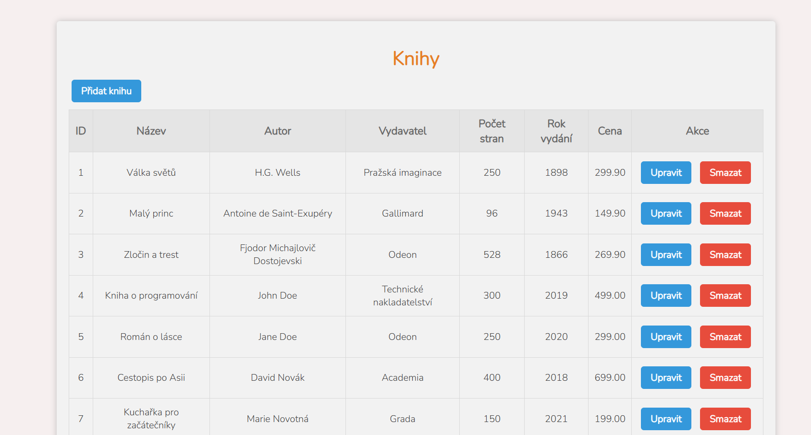
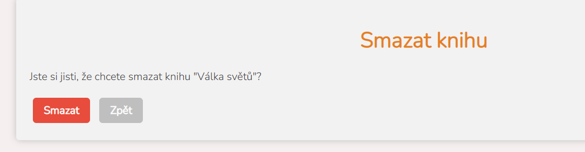

# DB-backend

> Zde je ukázána tabulka z databáze knih.

> Je zde možnost přidat, upravit a vymazat knihy. Backend je v PHP, databáze v MySQL a styl je napsán v CSS.

> Náhled úvodní stránky
> 

> Úprava knih
> 

> Mazání knih
> 

> Přidávání knih
> 
